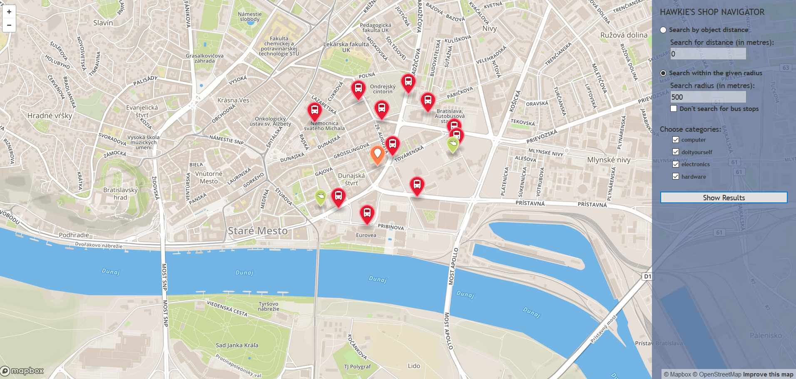

# Overview

This application shows in a map some types of shops which are within distance of the local public transport stops (MHD) in Bratislava. Most important features are:
- user can search in 2 modes:
  - 1. normal search for which the distance between stops and shops is important,
  - 2. search with choosing the initial "point" in whose area the search will be done,
- user for the 2nd "mode" can choose whether he wants to search with stops or only for shops
- user can filter the type of the shop (computer, hardware, do-it-yourself or electronics)

This is it in action:

User can choose from 2 searching modes. For each of them he must input a numeric value, which represents distance or search radius. User then chooses from 4 categories of shops which he wants to search for.

# Frontend

The frontend application was written using ASP.NET which uses HTML, CSS and JavaScript. The core of the frontend is written in JavaScript which contains functions for handling user input and interaction with the main side-bar used for managing user's request.

# Backend

The backend application is written in C# and is responsible for querying geo data, formatting the geojson and data for visualization.

## Data

Data was downloaded from Open Street Maps. These data are mostly from Bratislava and it's local neighbourhood. Data was put to PostgreSQL database using OSM2PGSQL and uses PostGIS. In the source code the coordinates and other meta-data are converted to GeoJSON which is used by MapBox.
